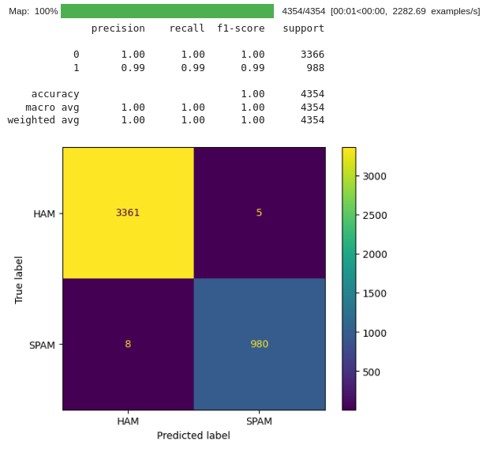

# Overview
This repository contains a file named BERTSMS.ipynb. In this document you will find a series of instructions to fine tune a BERT model for SMS spam classification. 
I used 3 different open source dataset for training: 

- Lingspam dataset
- Spamassassin dataset
- Sms-spam-collection

The implementation was inspired by "Spam Detection Using BERT", the article can be found here https://arxiv.org/abs/2206.02443. 

# Training
The BERT architecture was fine tuned with 14511 records and in a A100 GPU in a google colab.

# Testing
The model was tested with 4354 records and the results are shown here: 
